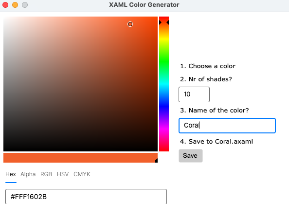

# XAML Color Generator

### A variation of https://github.com/wieslawsoltes/ColorPicker that takes a color and generates a .xaml/.axaml file with n shades.
#### Made with Avalonia 11

---------

I had to have a simple tool that generated colors into xaml files simple and easy. 



1. Choose a color
2. How many shades do you want?
3. Name the color to something nice.
4. Save the file and you'll have:
```
<ResourceDictionary xmlns="https://github.com/avaloniaui"
                    xmlns:x="http://schemas.microsoft.com/winfx/2006/xaml">
    <Color x:Key="Coral-0">#FFFFFFFF</Color>
    <Color x:Key="Coral-100">#FFFDEFE9</Color>
    <Color x:Key="Coral-200">#FFFCDFD4</Color>
    <Color x:Key="Coral-300">#FFFACFBF</Color>
    <Color x:Key="Coral-400">#FFF9BFAA</Color>
    <Color x:Key="Coral-500">#FFF8AF95</Color>
    <Color x:Key="Coral-600">#FFF69F7F</Color>
    <Color x:Key="Coral-700">#FFF58F6A</Color>
    <Color x:Key="Coral-800">#FFF37F55</Color>
    <Color x:Key="Coral-900">#FFF26F40</Color>
</ResourceDictionary>
```

